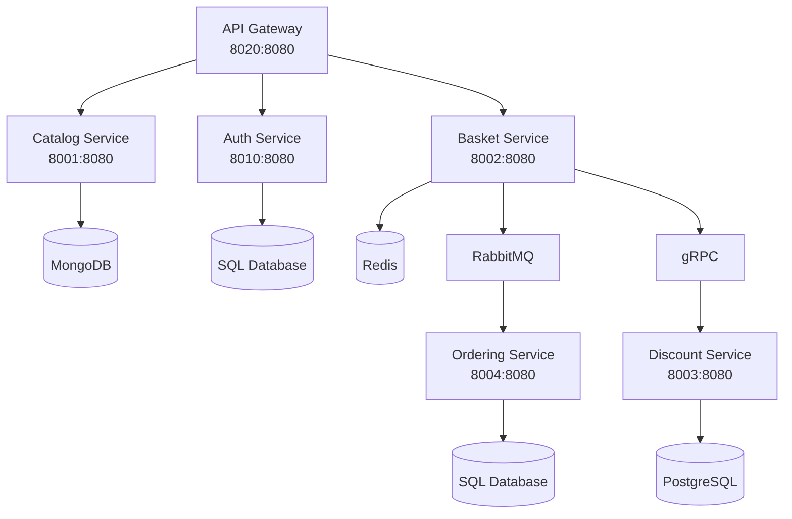
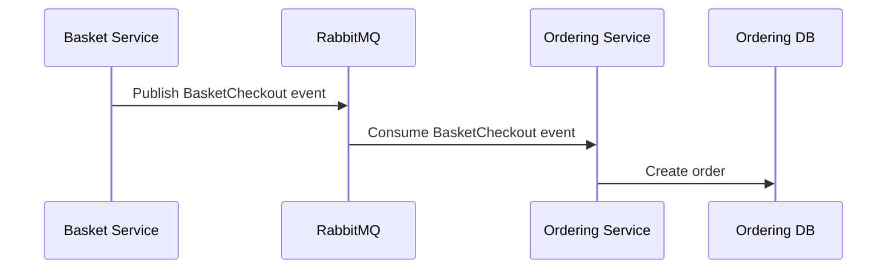

# E-Commerce Microservices Backend

Backend microservices system for an e-commerce application. The project is built as a set of independent services connected through an API Gateway, with service-to-service communication using REST, gRPC, RabbitMQ, Redis, and multiple databases.

## Service Architecture Image

> Add the service architecture image here.


## Architecture



## Services

| Service | Port | Database / Dependency | Responsibility |
|---|---:|---|---|
| API Gateway | 8020 | - | Main entry point for backend APIs |
| Catalog Service | 8001 | MongoDB | Manages products, categories, and brands |
| Auth Service | 8010 | SQL Database | Handles users, authentication, and authorization |
| Basket Service | 8002 | Redis, RabbitMQ, gRPC | Manages shopping baskets and checkout process |
| Discount Service | 8003 | PostgreSQL | Manages coupons and discount calculations |
| Ordering Service | 8004 | SQL Database, RabbitMQ | Creates and manages customer orders |

## System Flow

1. The client sends requests to the API Gateway.
2. The API Gateway routes each request to the required backend service.
3. Catalog Service handles products, categories, and brands.
4. Auth Service handles user authentication and authorization.
5. Basket Service stores basket data in Redis.
6. Basket Service communicates with Discount Service using gRPC.
7. Basket Service publishes checkout events to RabbitMQ.
8. Ordering Service consumes checkout events from RabbitMQ and creates orders.

## Tech Stack

- Microservices Architecture
- API Gateway
- REST APIs
- gRPC
- RabbitMQ
- Redis
- MongoDB
- SQL Database
- PostgreSQL
- Docker
- Docker Compose

## Ports

| Component | URL |
|---|---|
| API Gateway | `http://localhost:8020` |
| Catalog Service | `http://localhost:8001` |
| Auth Service | `http://localhost:8010` |
| Basket Service | `http://localhost:8002` |
| Discount Service | `http://localhost:8003` |
| Ordering Service | `http://localhost:8004` |

## Main Endpoints

### Catalog Service

| Method | Endpoint | Description |
|---|---|---|
| GET | `/products` | Get all products |
| GET | `/products/{id}` | Get product by id |
| GET | `/categories` | Get all categories |
| GET | `/brands` | Get all brands |

### Auth Service

| Method | Endpoint | Description |
|---|---|---|
| POST | `/auth/register` | Register a new user |
| POST | `/auth/login` | Login user |
| GET | `/auth/profile` | Get authenticated user profile |

### Basket Service

| Method | Endpoint | Description |
|---|---|---|
| GET | `/basket/{userName}` | Get user basket |
| POST | `/basket` | Create or update basket |
| DELETE | `/basket/{userName}` | Delete user basket |
| POST | `/basket/checkout` | Checkout basket |

### Discount Service

| Method | Endpoint | Description |
|---|---|---|
| GET | `/discount/{productName}` | Get discount by product name |
| POST | `/discount` | Create discount coupon |
| PUT | `/discount` | Update discount coupon |
| DELETE | `/discount/{productName}` | Delete discount coupon |

### Ordering Service

| Method | Endpoint | Description |
|---|---|---|
| GET | `/orders/{userName}` | Get orders by username |
| GET | `/orders/order/{id}` | Get order by id |
| POST | `/orders` | Create order |

> Update endpoint paths if your actual controller routes are different.

## Prerequisites

Make sure you have installed:

- Docker
- Docker Compose
- .NET SDK
- Git

## Run With Docker Compose

Start all services:

```bash
docker compose up -d
```

Stop all services:

```bash
docker compose down
```

Rebuild and start all services:

```bash
docker compose up -d --build
```

Check running containers:

```bash
docker ps
```

View logs:

```bash
docker logs <container-name>
```

## Environment Variables

Example environment configuration:

```env
ASPNETCORE_ENVIRONMENT=Development

MongoDbSettings__ConnectionString=mongodb://catalogdb:27017
MongoDbSettings__DatabaseName=CatalogDb

ConnectionStrings__AuthDb=Server=authdb;Database=AuthDb;User Id=sa;Password=Your_password123;
ConnectionStrings__OrderingDb=Server=orderingdb;Database=OrderingDb;User Id=sa;Password=Your_password123;
ConnectionStrings__DiscountDb=Host=discountdb;Database=DiscountDb;Username=postgres;Password=postgres;

RedisSettings__ConnectionString=basketdb:6379

RabbitMQSettings__Host=rabbitmq
RabbitMQSettings__Username=guest
RabbitMQSettings__Password=guest
```

## Databases

| Service | Database |
|---|---|
| Catalog Service | MongoDB |
| Auth Service | SQL Database |
| Basket Service | Redis |
| Discount Service | PostgreSQL |
| Ordering Service | SQL Database |

## Service Communication

### REST

The API Gateway communicates with backend services using HTTP/REST.

### gRPC

Basket Service communicates with Discount Service using gRPC to retrieve discount information during basket updates or checkout.

### RabbitMQ

Basket Service publishes checkout events to RabbitMQ. Ordering Service consumes these events and creates orders.



## Project Structure

```txt
src/
  ApiGateway/
  Services/
    Catalog/
    Auth/
    Basket/
    Discount/
    Ordering/
docker-compose.yml
README.md
```

## Development

Run a specific service locally:

```bash
dotnet run
```

Run tests:

```bash
dotnet test
```

## Troubleshooting

### Port Already In Use

Make sure no other service is running on the same port.

```bash
docker ps
docker stop <container-name>
```

### Database Connection Failed

Check that the database container is running and that the connection string matches the Docker service name.

### RabbitMQ Connection Failed

Make sure RabbitMQ is running and the service is using the correct host, username, and password.

### Redis Connection Failed

Make sure Redis is running and Basket Service is using the correct Redis connection string.

## Future Improvements

- Add centralized logging
- Add distributed tracing
- Add health checks for all services
- Add Swagger/OpenAPI documentation
- Add CI/CD pipeline
- Add unit and integration tests
- Add monitoring with Prometheus and Grafana

## License

This project is for educational and development purposes.
